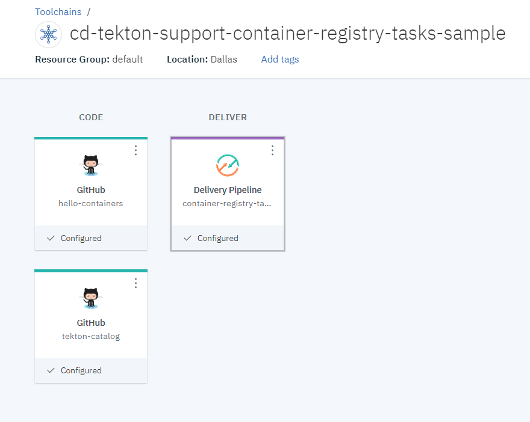
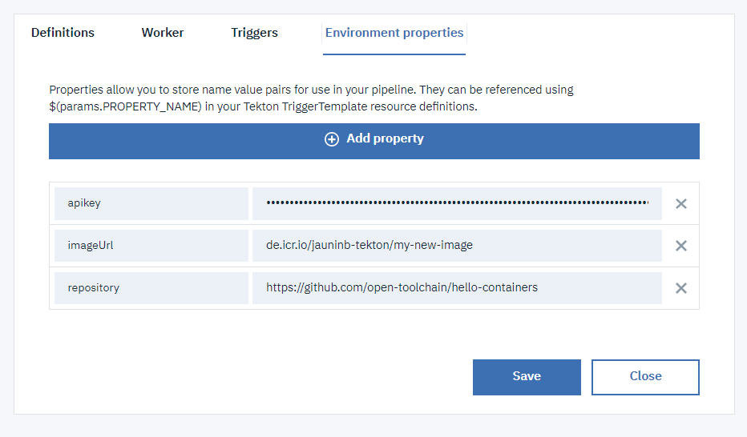

# Container-Registry related tasks

- **containerize-task**: This task is building and pushing an image to [IBM Cloud Container Registry](https://cloud.ibm.com/docs/services/Registry?topic=registry-getting-started). This taks is relying on [Buildkit](https://github.com/moby/buildkit) to perform the build of the image.
- **execute-in-dind-task**: This task runs `docker` commands (build, inspect...) that communicate with a sidecar dind, and push the resulting image to the [IBM Cloud Container Registry](https://cloud.ibm.com/docs/services/Registry?topic=registry-getting-started).
- **vulnerability-advisor-task**: This task is verifying that a [Vulnerability Advisor scan](https://cloud.ibm.com/docs/services/Registry?topic=va-va_index) has been made for the image and process the outcome of the scan.

**WARNING: These tasks needs to run on Kubernetes cluster with minimal version 1.16. If you are using your own Delivery Pipeline Private Worker to run your tekton pipeline(s), ensure your cluster is updated to this version at least.**

## Install the Tasks
- Add a github integration in your toolchain to the repository containing the task (https://github.com/open-toolchain/tekton-catalog)
- Add that github integration to the Definitions tab of your Continuous Delivery tekton pipeline, with the Path set to `container-registry`

## Build Image helper task

### Inputs

#### Context - ConfigMap/Secret

  The task expects the following kubernetes resources to be defined:

* **Secret cd-secret**

  Secret containing:
  * **API_KEY**: An IBM Cloud Api Key use to access to the IBM Cloud Container registry service (https://cloud.ibm.com/iam/apikeys)

  See [sample TriggerTemplate](./sample/listener-containerize.yaml) on how to create the secret using `resourcetemplates` in a `TriggerTemplate`

#### Parameters

* **task-pvc**: the output pvc - this is the name of the PVC that is mounted for the execution of the task
* **pathToContext**: (optional) the path to the context that is used for the build (default to `.` meaning current directory)
* **pathToDockerfile**: (optional) the path to the Dockerfile that is used for the build (default to `.` meaning current directory)
* **buildkit_image**: (optional) The name of the BuildKit image used (default to `moby/buildkit:v0.6.3-rootless`)
* **directoryName**: (optional) name of the new directory to clone into (default to `.` in order to clone at the root of the volume mounted for the pipeline run). Note: It will be to the "humanish" part of the repository if this param is set to blank
* **additionalTags**: (optional) comma-separated list of tags for the built image
* **additionalTagsScript**: (optional) Shell script commands that will be invoked to provide additional tags for the build image
* **propertiesFile**: (optional) name of the properties file that will be created (if needed) or updated (if existing) as an additional outcome of this task in the pvc. This file will contains the image registry-related information (`REGISTRY_URL`, `REGISTRY_NAMESPACE`, `REGISTRY_REGION`, `IMAGE_NAME`, `IMAGE_TAGS` and `IMAGE_MANIFEST_SHA`)
* **resourceGroup**: (optional) target resource group (name or id) for the ibmcloud login operation

### Outputs

#### Resources

* **builtImage**: The Image PipelineResource that will be created as output of this task.

## Docker In Docker (DIND) helper task
This task runs `docker` commands (build, inspect...) that communicate with a sidecar dind,
and push the resulting image to the IBM Cloud Container Registry.

**Note:** the **Docker engine** used to execute the commands is **transient**, created by the task as a sidecar container,
and is available only during the task's lifespan.

### Inputs

#### Context - ConfigMap/Secret

  The task expects the following kubernetes resources to be defined:

* **Secret cd-secret**

  Secret containing:
  * **API_KEY**: An IBM Cloud Api Key use to access to the IBM Cloud Container registry service (https://cloud.ibm.com/iam/apikeys)

  See [sample TriggerTemplate](./sample/listener-docker-in-docker.yaml) on how to create the secret using `resourcetemplates` in a `TriggerTemplate`

#### Parameters

* **task-pvc**: the output pvc - this is the name of the PVC that is mounted for the execution of the task
* **imageTag**: (optional) the tag for the built image (default to `latest`) 
* **pathToDockerfile**: (optional) the path to the Dockerfile that is used for the build (default to `/`) 
* **dockerfile**: (optional) the name of the Dockerfile that is used for the build (default to `Dockerfile`) 
* **dockerClientImage**: (optional) The Docker image to use to run the Docker client (default to `docker`) 
* **propertiesFile**: (optional) name of the properties file that will be created (if needed) or updated (if existing) as an additional outcome of this task in the pvc. This file will contains the image registry-related information (`REGISTRY_URL`, `REGISTRY_NAMESPACE`, `IMAGE_NAME`, `IMAGE_TAGS` and `IMAGE_MANIFEST_SHA`)
* **dockerCommands**: (optional) The docker command(s) to run. Default commands:
```
docker build --tag "$IMAGE_URL:$IMAGE_TAG" --file /artifacts$PATH_TO_DOCKERFILE$DOCKERFILE /artifacts$PATH_TO_DOCKERFILE
docker inspect ${IMAGE_URL}:${IMAGE_TAG}
docker push ${IMAGE_URL}:${IMAGE_TAG}
```

### Outputs

#### Resources

* **builtImage**: The Image PipelineResource that will be created as output of this task.

## Vulnerability Advisor helper task

### Inputs

#### Context - ConfigMap/Secret

  The task expects the following kubernetes resources to be defined:

* **Secret cd-secret**

  Secret containing:
  * **API_KEY**: An IBM Cloud Api Key use to access to the IBM Cloud Container registry service (https://cloud.ibm.com/iam/apikeys)

  See [sample TriggerTemplate](./sample/listener-containerize.yaml) on how to create the secret using `resourcetemplates` in a `TriggerTemplate`

#### Parameters

* **task-pvc**: the output pvc - this is the name of the PVC that is mounted for the execution of the task
* **imagePropertiesFile**: file containing properties of the image to be scanned (default to 'build.properties')
* **maxIteration**: maximum number of iterations allowed while loop to check for va report (default to 30 iterations maximum)
* **sleepTime**: sleep time (in seconds) between invocation of ibmcloud cr va in the loop (default to 10 seconds between scan result inquiry)
* **scanReportFile**: (optional) filename for the scan report (json format) of the given image. It will be copied in the task-pvc
* **failOnScannedIssues**: flag (`true` | `false`) to indicate if the task should fail or continue if issues are found in the image scan result (default to 'true')
* **resourceGroup**: (optional) target resource group (name or id) for the ibmcloud login operation

#### Resources

* **image**: The Image PipelineResource that this task will process the Vulnerability Advisor scan result.

# Usage
The `sample` sub-directory contains an EventListener definition that you can include in your tekton pipeline configuration to run an example usage of the `containerize-task` and `vulnerability-advisor-task`.

**Note:** This sample also rely on the clone-repo task to clone the application to containerize.

1) Create a toolchain (or update a toolchain) to include:

   - the git repository that you want to clone, which can be private
   - the repository containing this tekton task
   - a tekton pipeline definition

   

2) Add the definitions:

   - for the `clone-repo-task` (`git` path)
   - for this task and the sample (`container-registry` and `container-registry/sample` paths)

   

3) Add the environment properties:

   - `apikey` to provide an API key used for the ibmcloud login/access
   - `repository` to indicate the git repository url to clone (correspoding to the one integrated in the toolchain)
   - `imageUrl` to indicate the URL of the image to push to the IBM Cloud Container Registry

   

4) Create a manual trigger to start the sample listener

   

5) Run the pipeline

6) After the pipeline ran successfully, if you look at the IBM Cloud container registry content referenced within the Image url definition, you will see an image with the expected tags:
   ```
    $ ibmcloud cr images
    Listing images...

    Repository                              Tag                                                     Digest         Namespace        Created         Size    Security status
    de.icr.io/jauninb-tekton/my-new-image   1.0.0-dev                                               5107dea95bd0   jauninb-tekton   6 minutes ago   54 MB   No Issues
    de.icr.io/jauninb-tekton/my-new-image   1.0.0-master-e8e9fa6b7827d7898d04a218fa69f327db7fc2b4   5107dea95bd0   jauninb-tekton   6 minutes ago   54 MB   No Issues

    OK
   ```
